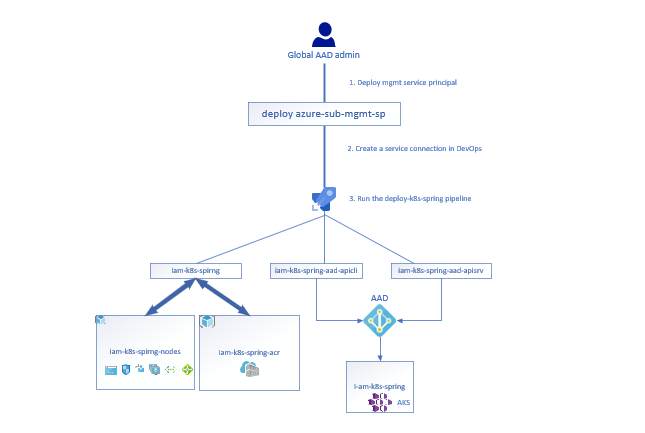
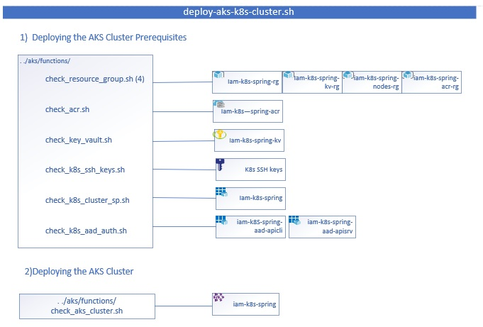

# Building a Practical YAML Build Pipeline for an AKS Cluster

We will be covering how to build an Azure DevOps Build Pipeline for an AKS Cluster from scratch and how to connect Pods in the Cluster to Services running in Azure. Additionally, we'll be making the entire process idempotent and providing recommendations for how you can implement this in your own environment.

<br/>

- [Building a Practical YAML Build Pipeline for an AKS Cluster](#building-a-practical-yaml-build-pipeline-for-an-aks-cluster)
  - [Prerequisites](#prerequisites)
  - [Deployment Overview](#deployment-overview)
  - [Create a new Project in your Azure DevOps Account](#create-a-new-project-in-your-azure-devops-account)
  - [Clone this Respository into your Azure DevOps Project](#clone-this-respository-into-your-azure-devops-project)
  - [Create a Management Service Principal for your Azure Subscription](#create-a-management-service-principal-for-your-azure-subscription)
  - [Create a Service Connection in your Azure DevOps Project](#create-a-service-connection-in-your-azure-devops-project)
  - [Create a YAML Build Pipeline](#create-a-yaml-build-pipeline)
  - [Deploy the AKS Cluster using the YAML Build Pipeline](#deploy-the-aks-cluster-using-the-yaml-build-pipeline)
  - [Add cluster-admins to the AKS Cluster through the YAML Build Pipeline](#add-cluster-admins-to-the-aks-cluster-through-the-yaml-build-pipeline)
  - [Verify cluster-admin access to the Cluster](#verify-cluster-admin-access-to-the-cluster)
  - [Deploy a Key Vault for the PostgreSQL Server using the YAML Build Pipeline](#deploy-a-key-vault-for-the-postgresql-server-using-the-yaml-build-pipeline)
  - [Deploy the PostgreSQL Resources using the YAML Build Pipeline](#deploy-the-postgresql-resources-using-the-yaml-build-pipeline)
  - [Deploy the Spring App to the AKS Cluster using the YAML Build Pipeline](#deploy-the-spring-app-to-the-aks-cluster-using-the-yaml-build-pipeline)
  - [Verify Access to the Spring App](#verify-access-to-the-spring-app)
  - [Verify the Spring App is connected to the PostgreSQL Server Database](#verify-the-spring-app-is-connected-to-the-postgresql-server-database)
  - [Remove the deployed resources in Azure](#remove-the-deployed-resources-in-azure)

<br/>

## Prerequisites

Make sure you have access to an **Azure Account** with the following permissions:

* Owner Rights in the Azure Subscription you are working with.
* Global Admin Rights in the Azure Active Directory associated with the Azure Subscription you are working with.

<br/>

Make sure you have access to a Linux VM (locally or in Azure) running **Ubuntu 18.04 LTS** or higher with the following packages installed.

```text
azure-cli
kubectl
git
jq
sed
awk
docker
psql
```

<br/>

## Deployment Overview


## Create a new Project in your Azure DevOps Account

Browse to [https://dev.azure.com](https://dev.azure.com) and create an account in Azure DevOps if you don't already have one.

Next, create a new Project in Azure DevOps.

<br/>

## Clone this Respository into your Azure DevOps Project

Either use or create an existing repository in your Azure DevOps Project and then clone it into Visual Studio Code. Once the directory is available locally to you, then download the **iam-conf-2020-aks-practical-yaml** Repository on GitHub as a ZIP File to your PC using the following link.

```text
https://github.com/starkfell/iam-conf-2020-aks-practical-yaml/archive/master.zip
```

Next, extract and copy the contents of the zip file into your Azure DevOps repository and then sync it back to Azure DevOps using Visual Studio Code.

<br/>

## Create a Management Service Principal for your Azure Subscription



As we covered in our presentation, it's never a good idea to use a regular User Account to deploy and manage resources in Azure for two reasons

* A User account is more susceptible to a security breach
* A User account will break automation

Follow the instructions below to create a Management Service Principal in your Azure Subscription.

<br/>

To start, clone the **iam-conf-2020-aks-practical-yaml** Repository to your Linux Host.

```bash
git clone https://github.com/starkfell/iam-conf-2020-aks-practical-yaml.git
```

> **NOTE:** Since the contents of the repository in Github and in Azure DevOps are identical, this step will work as intended. Under normal circumstances, you'd want to be only cloning the Repository from your Azure DevOps Project.

<br/>

Next, Create the following Static Variables shown below. replace their values with those relevant to your environment.

```bash
SP_BASE_NAME="az-sub-mgmt-vs-ent-msdn"
AZURE_LOCATION="westeurope"
AZURE_SUBSCRIPTION_TENANT_ID="7f24e4c5-12f1-4047-afa1-c15d6927e745"
AZURE_SUBSCRIPTION_ID="84f065f5-e37a-4127-9c82-0b1ecd57a652"
K8S_BASE_NAME="iam-k8s-spring"
```

For the **SP_BASE_NAME** variable, we are using a naming convention that combines the purpose of the Management Service Principal and where it is being used.

```text
Azure Subscription Management                               --> az-sub-mgmt
Azure Subscription Name: Visual Studio Enterprise with MSDN --> vs-ent-msdn
Final Name:                                                     az-sub-mgmt-vs-ent-msdn
```

We suggest using a naming convention that helps you to easily identify the purpose and location of the Service Principal.

<br/>

Change over to the **prerequisite-scripts** Directory in the Repo.

```bash
cd iam-conf-2020-aks-practical-yaml/prerequisite-scripts
```

Make the **deploy-sp-for-azure-sub-mgmt.sh** script exectuable.

```bash
chmod 775 deploy-sp-for-azure-sub-mgmt.sh
```

Next, deploy the Management Service Principal in the Azure Subscription.

```bash
./deploy-sp-for-azure-sub-mgmt.sh \
-a "$AZURE_SUBSCRIPTION_TENANT_ID" \
-s "$AZURE_SUBSCRIPTION_ID" \
-d "${SP_BASE_NAME}-sp" \
-f "$AZURE_LOCATION" \
-g "$SP_BASE_NAME" \
-h "$SP_BASE_NAME"
```

<br/>

When prompted, login to Azure using an Azure Account with a Global Administrator Rights in AAD and Owner rights in the Azure Subscription.

```console
To sign in, use a web browser to open the page https://microsoft.com/devicelogin and enter the code DJGGUGM4A to authenticate.
```

<br/>

Once you have logged in, the Management Service Principal will be deployed and should return output similar to what is shown below.

```text
[---success---] Logged into Azure.
[---success---] Azure CLI set to Azure Subscription [84f065f5-e37a-4127-9c82-0b1ecd57a652].
[---success---] The Name of the Azure Subscription is [Visual Studio Enterprise with MSDN].
[---info------] The Service Principal [az-sub-mgmt-vs-ent-msdn-sp] was not found.
[---success---] Created Service Principal [az-sub-mgmt-vs-ent-msdn-sp]
[---success---] Updated Azure App [az-sub-mgmt-vs-ent-msdn-sp] with the 'azure-sub-mgmt-manifest'.
[---info------] Resource Group [az-sub-mgmt-vs-ent-msdn] not found.
[---success---] Created the Resource Group [az-sub-mgmt-vs-ent-msdn].
[---info------] Key Vault [az-sub-mgmt-vs-ent-msdn] not found.
[---info------] Key Vault [az-sub-mgmt-vs-ent-msdn] found soft-deleted.
[---success---] Retrieved the Location [westeurope] of soft-deleted Key Vault [az-sub-mgmt-vs-ent-msdn].
[---success---] Purged soft-deleted Key Vault [az-sub-mgmt-vs-ent-msdn].
[---success---] Deployed Key Vault [az-sub-mgmt-vs-ent-msdn] to Resource Group [az-sub-mgmt-vs-ent-msdn].
[---success---] Service Principal Application ID [bec6ba92-edec-4557-96ac-a0db005f655c] added to Key Vault [az-sub-mgmt-vs-ent-msdn].
[---success---] Service Principal Username [http://az-sub-mgmt-vs-ent-msdn-sp] added to Key Vault [az-sub-mgmt-vs-ent-msdn].
[---success---] Service Principal Password for [az-sub-mgmt-vs-ent-msdn-sp] added to Key Vault [az-sub-mgmt-vs-ent-msdn].
[---success---] Waiting 30 seconds to allow the resource access definitions to propagate from'azure-sub-mgmt-manifest.json'.
[---success---] Granted Admin Consent on the resource access definition for Azure App [az-sub-mgmt-vs-ent-msdn-sp].
[---info------] Service Connection Information to use is shown below:
[---info------]
[---info------] Subscription Id:         [84f065f5-e37a-4127-9c82-0b1ecd57a652]
[---info------] Subscription Name:       [Visual Studio Enterprise with MSDN]
[---info------] Service Principal Id:    [bec6ba92-edec-4557-96ac-a0db005f655c]
[---info------] Service Principal Key:   [ZIXhqtR~dYzSFKU7E854c5lYpsIc5qLdFD]
[---info------] Tenant Id:               [7f24e4c5-12f1-4047-afa1-c15d6927e745]
[---info------] Service Connection Name: [az-sub-mgmt-vs-ent-msdn-sp]
[---info------]
[---success---] Logged out of the Azure Subscription [84f065f5-e37a-4127-9c82-0b1ecd57a652].
[---success---] Deployment of Service Principal [az-sub-mgmt-vs-ent-msdn-sp] in Azure Subscription [84f065f5-e37a-4127-9c82-0b1ecd57a652] is complete.
```

<br/>

> **NOTE:** Make sure to save the output from the **deploy-sp-for-azure-sub-mgmt.sh** script as it will be used in the next section.

<br/>

## Create a Service Connection in your Azure DevOps Project

Next, we need to create a Service Connection to allow Azure DevOps to manage resources in our Azure Subscription using the Management Service Principal.

<br/>

In Azure DevOps, browse to your **Project** and then click on **Project Settings** and then on **Service connections**.

Next, click on **Create service connection** or **New service connection**.

Next, click on **Azure Resource Manager** and then click on **Next**.

Next, click on **Service principal (manual)** and then click on **Next**.

Next, leave the **Environment** field set to **Azure Cloud** and leave the **Scope Level** to **Subscription**.

In the **Subscription Id** field paste in your **Azure Subscription Id**.

In the **Subscription Name** field paste in your **Azure Subscription Name**.

In the **Service Principal Id** field paste in the **Application Id** of the Management Service Principal.

In the **Service Principal Key** field, paste in the **Password** of the Management Service Principal.

In the **Tenant ID** field, paste in your **Azure Subscription Tenant Id**.

In the **Service connection name** field, type in the value of the **SP_BASE_NAME** variable you set earlier or the **Name** of your Azure Subscription.

Next, click on the **Verify and Save** button.

<br/>

> **NOTE:** The **Service connection name** field is important in that it's name is used to reference the Service Connection in our YAML Build Pipeline files and is an identifier as to which Azure Subscription it is connected to. Make sure to take this into account before providing your value for this field.

<br/>

## Create a YAML Build Pipeline

Next, we are going to create our initial YAML Build Pipeline to start deploying resources into our Azure Subscription using the **deploy-k8s-spring.yaml** file.

<br/>

In Azure DevOps, browse to your **Project** and then click on **Pipelines** and then click on **Create Pipeline**.

Next, click on Azure Repos Git.

Next, click on the name of the repository you cloned this into from GitHub earlier.

Next, click on **Existing Azure Pipelines YAML file**.

Next, leave the Branch field set to **master** and change the Path field to **/build-pipelines/deploy-k8s-spring.yaml**. Afterwards, click on Continue.

Next, you should see the following content in the YAML File. If the content below isn't in the file, copy and paste it in.

```yaml
# Build is automatically triggered from the master branch in the Repo.
trigger:
- master

# Using an Azure DevOps Linux Agent.
pool:
  vmImage: ubuntu-latest

steps:
- script: echo "Building a Pratical YAML Pipeline for AKS."
  displayName: '¯\_(ツ)_/¯'

```

<br/>

Next, click on **Run**.

Next, browse to Pipelines and click on the Name of the Pipeline you just created.

Next, click on the three vertical dots button in the top right-hand corner and click on **Rename/move**.

Change the Name field to **deploy-k8s-spring** and click on **Save**.

By this time, the Pipeline Run should have successfully completed. Feel free to review the Pipeline Job. 

<br/>

## Deploy the AKS Cluster using the YAML Build Pipeline



Next, open up the **deploy-k8s-spring.yaml** file in Visual Studio Code.

Copy the following YAML content into the **deploy-k8s-spring.yaml** file.

```yaml
# Build is automatically triggered from the master branch in the Repo.
trigger:
- master

# Using an Azure DevOps Linux Agent.
pool:
  vmImage: ubuntu-latest

steps:
- script: echo "Building a Pratical YAML Pipeline for AKS."
  displayName: '¯\_(ツ)_/¯'

# Deploying AKS Cluster - iam-k8s-spring.
- task: AzureCLI@2
  displayName: 'Deploying AKS Cluster - iam-k8s-spring'
  inputs:
    # Using the Service Connection and Service Principal, 'az-sub-mgmt-vs-ent-msdn-sp', to authenticate to the Azure Subscription
    # for this Azure CLI Task and all subsequent tasks in this Pipeline.
    azureSubscription: 'az-sub-mgmt-vs-ent-msdn-sp'
    scriptType: 'bash'
    scriptLocation: 'scriptPath'
    scriptPath: './aks/deploy-aks-k8s-cluster.sh'
    arguments: '-a iam-k8s-spring
    -s 7f24e4c5-12f1-4047-afa1-c15d6927e745
    -d 84f065f5-e37a-4127-9c82-0b1ecd57a652
    -f rhand18yahoo.onmicrosoft.com
    -g westeurope
    -h 1.18.4-std-ds2-v3.json'
```

<br/>

Save the changes to the file in Visual Studio Code and then sync the file into the Azure DevOps repository.

Next, in Azure DevOps, browse to the Build Pipeline and verify that the deployment of the AKS Cluster is running.

<br/>

## Add cluster-admins to the AKS Cluster through the YAML Build Pipeline

Our next task is to add **cluster-admin** users to the AKS Cluster.

<br/>

Next, open up the **deploy-k8s-spring.yaml** file in Visual Studio Code.

Replace the existing content in the **deploy-k8s-spring.yaml** file with the following.

```yaml
# Build is automatically triggered from the master branch in the Repo.
trigger:
- master

# Using an Azure DevOps Linux Agent.
pool:
  vmImage: ubuntu-latest

steps:
- script: echo "Building a Pratical YAML Pipeline for AKS."
  displayName: '¯\_(ツ)_/¯'

# Deploying AKS Cluster - iam-k8s-spring.
- task: AzureCLI@2
  displayName: 'Deploying AKS Cluster - iam-k8s-spring'
  inputs:
    # Using the Service Connection and Service Principal, 'az-sub-mgmt-vs-ent-msdn-sp', to authenticate to the Azure Subscription
    # for this Azure CLI Task and all subsequent tasks in this Pipeline.
    azureSubscription: 'az-sub-mgmt-vs-ent-msdn-sp'
    scriptType: 'bash'
    scriptLocation: 'scriptPath'
    scriptPath: './aks/deploy-aks-k8s-cluster.sh'
    arguments: '-a iam-k8s-spring
    -s 7f24e4c5-12f1-4047-afa1-c15d6927e745
    -d 84f065f5-e37a-4127-9c82-0b1ecd57a652
    -f rhand18yahoo.onmicrosoft.com
    -g westeurope
    -h 1.18.4-std-ds2-v3.json'

# Adding cluster-admin Users to AKS Cluster - iam-k8s-spring.
- task: AzureCLI@2
  displayName: 'Adding cluster-admin Users to AKS Cluster - iam-k8s-spring'
  inputs:
    azureSubscription: 'az-sub-mgmt-vs-ent-msdn-sp'
    scriptType: 'bash'
    scriptLocation: 'scriptPath'
    scriptPath: './aks/add-cluster-admins-to-aks-cluster.sh'
    arguments: '-a iam-k8s-spring
    -s rhand18yahoo.onmicrosoft.com
    -d rhand18@yahoo.com,yerna.marie@gmail.com
    -f westeurope'
```

<br/>

> **NOTE**: Make sure to replace **rhand18@yahoo.com,yerna.marie@gmail.com** with the e-mail accounts (comma-separated) of the Users you want to grant cluster-admin access to the AKS Cluster.

<br/>

Save the changes to the file in Visual Studio Code and then sync the file into the Azure DevOps repository.

<br/>

## Verify cluster-admin access to the Cluster

Next, log back into the Azure Subscription where you deployed the AKS Cluster.

```bash
az login
```

<br/>

> **NOTE**: If you have access to multiple subscriptions, make sure to set to the Azure Subscription where the AKS Cluster is running.

```bash
az account set --subscription $AZURE_SUBSCRIPTION_ID
```

<br/>

Next, retrieve the AKS Cluster **kubeconfig** file.

```bash
az aks get-credentials \
--resource-group "$K8S_BASE_NAME" \
--name "$K8S_BASE_NAME" \
--file ./cluster-admin-kubeconfig \
--overwrite-existing
```

<br/>

Next, set the **KUBECONFIG** environment variable to point to the **cluster-admin-kubeconfig** file.

```bash
export KUBECONFIG=./cluster-admin-kubeconfig
```

<br/>

Next, run the following command to verify connectivity to the Kubernetes Cluster.

```bash
kubectl get nodes
```

When you are prompted, log in as one of the User's that you granted **cluster-admin** rights to on the AKS Cluster.

```bash
To sign in, use a web browser to open the page https://microsoft.com/devicelogin and enter the code DS9LNWEPB to authenticate.
```

<br/>

During the login process, make sure to check the checkbox that states **Consent on behalf of your organization**.

<br/>

Once you have logged in, you should get the following response back.

```bash
NAME                                 STATUS   ROLES   AGE   VERSION
aks-springboot-88109707-vmss000000   Ready    agent   34m   v1.18.4
aks-springboot-88109707-vmss000001   Ready    agent   34m   v1.18.4
```

<br/>

## Deploy a Key Vault for the PostgreSQL Server using the YAML Build Pipeline

Our next task is to create a Key Vault for the PostgreSQL Server being deployed.

<br/>

Next, open up the **deploy-k8s-spring.yaml** file in Visual Studio Code.

Replace the existing content in the **deploy-k8s-spring.yaml** file with the following.

```yaml
# Build is automatically triggered from the master branch in the Repo.
trigger:
- master

# Using an Azure DevOps Linux Agent.
pool:
  vmImage: ubuntu-latest

steps:
- script: echo "Building a Pratical YAML Pipeline for AKS."
  displayName: '¯\_(ツ)_/¯'

# Deploying AKS Cluster - iam-k8s-spring.
- task: AzureCLI@2
  displayName: 'Deploying AKS Cluster - iam-k8s-spring'
  inputs:
    # Using the Service Connection and Service Principal, 'az-sub-mgmt-vs-ent-msdn-sp', to authenticate to the Azure Subscription
    # for this Azure CLI Task and all subsequent tasks in this Pipeline.
    azureSubscription: 'az-sub-mgmt-vs-ent-msdn-sp'
    scriptType: 'bash'
    scriptLocation: 'scriptPath'
    scriptPath: './aks/deploy-aks-k8s-cluster.sh'
    arguments: '-a iam-k8s-spring
    -s 7f24e4c5-12f1-4047-afa1-c15d6927e745
    -d 84f065f5-e37a-4127-9c82-0b1ecd57a652
    -f rhand18yahoo.onmicrosoft.com
    -g westeurope
    -h 1.18.4-std-ds2-v3.json'

# Adding cluster-admin Users to AKS Cluster - iam-k8s-spring.
- task: AzureCLI@2
  displayName: 'Adding cluster-admin Users to AKS Cluster - iam-k8s-spring'
  inputs:
    azureSubscription: 'az-sub-mgmt-vs-ent-msdn-sp'
    scriptType: 'bash'
    scriptLocation: 'scriptPath'
    scriptPath: './aks/add-cluster-admins-to-aks-cluster.sh'
    arguments: '-a iam-k8s-spring
    -s rhand18yahoo.onmicrosoft.com
    -d rhand18@yahoo.com,yerna.marie@gmail.com
    -f westeurope'

# Deploying PostgreSQL Key Vault for iam-k8s-spring.
- task: AzureCLI@2
  displayName: 'Deploying PostgreSQL Key Vault for iam-k8s-spring'
  inputs:
    azureSubscription: 'az-sub-mgmt-vs-ent-msdn-sp'
    scriptType: 'bash'
    scriptLocation: 'scriptPath'
    scriptPath: './aks/deploy-postgresql-kv.sh'
    arguments: '-a iam-k8s-spring
    -s westeurope'
```

<br/>

Save the changes to the file in Visual Studio Code and then sync the file into the Azure DevOps repository.

<br/>

## Deploy the PostgreSQL Resources using the YAML Build Pipeline

Our next task is to deploy a PostgreSQL Server and Database for use by our Spring App.

Next, open up the **deploy-k8s-spring.yaml** file in Visual Studio Code.

Replace the existing content in the **deploy-k8s-spring.yaml** file with the following.

```yaml
# Build is automatically triggered from the master branch in the Repo.
trigger:
- master

# Using an Azure DevOps Linux Agent.
pool:
  vmImage: ubuntu-latest

steps:
- script: echo "Building a Pratical YAML Pipeline for AKS."
  displayName: '¯\_(ツ)_/¯'

# Deploying AKS Cluster - iam-k8s-spring.
- task: AzureCLI@2
  displayName: 'Deploying AKS Cluster - iam-k8s-spring'
  inputs:
    # Using the Service Connection and Service Principal, 'az-sub-mgmt-vs-ent-msdn-sp', to authenticate to the Azure Subscription
    # for this Azure CLI Task and all subsequent tasks in this Pipeline.
    azureSubscription: 'az-sub-mgmt-vs-ent-msdn-sp'
    scriptType: 'bash'
    scriptLocation: 'scriptPath'
    scriptPath: './aks/deploy-aks-k8s-cluster.sh'
    arguments: '-a iam-k8s-spring
    -s 7f24e4c5-12f1-4047-afa1-c15d6927e745
    -d 84f065f5-e37a-4127-9c82-0b1ecd57a652
    -f rhand18yahoo.onmicrosoft.com
    -g westeurope
    -h 1.18.4-std-ds2-v3.json'

# Adding cluster-admin Users to AKS Cluster - iam-k8s-spring.
- task: AzureCLI@2
  displayName: 'Adding cluster-admin Users to AKS Cluster - iam-k8s-spring'
  inputs:
    azureSubscription: 'az-sub-mgmt-vs-ent-msdn-sp'
    scriptType: 'bash'
    scriptLocation: 'scriptPath'
    scriptPath: './aks/add-cluster-admins-to-aks-cluster.sh'
    arguments: '-a iam-k8s-spring
    -s rhand18yahoo.onmicrosoft.com
    -d rhand18@yahoo.com,yerna.marie@gmail.com
    -f westeurope'

# Deploying PostgreSQL Key Vault for iam-k8s-spring.
- task: AzureCLI@2
  displayName: 'Deploying PostgreSQL Key Vault for iam-k8s-spring'
  inputs:
    azureSubscription: 'az-sub-mgmt-vs-ent-msdn-sp'
    scriptType: 'bash'
    scriptLocation: 'scriptPath'
    scriptPath: './aks/deploy-postgresql-kv.sh'
    arguments: '-a iam-k8s-spring
    -s westeurope'

# Deploying PostgreSQL Server and Databases for iam-k8s-spring.
- task: AzureCLI@2
  displayName: 'Deploying PostgreSQL Server and Databases for iam-k8s-spring'
  inputs:
    azureSubscription: 'az-sub-mgmt-vs-ent-msdn-sp'
    scriptType: 'bash'
    scriptLocation: 'scriptPath'
    scriptPath: './aks/deploy-postgresql-resources.sh'
    arguments: '-a iam-k8s-spring
    -s 213.47.155.102
    -d pgadmin
    -f springdb
    -g westeurope'
```

<br/>

> **NOTE**: Make sure to replace **213.47.155.102** with a list of IP Addresses (comma-separated) that you want to have direct access to the PostgreSQL Server.

> **NOTE**: The name of your PostgreSQL Server must be globally unique!

<br/>

Save the changes to the file in Visual Studio Code and then sync the file into the Azure DevOps repository.

<br/>

## Deploy the Spring App to the AKS Cluster using the YAML Build Pipeline

Our next task is to deploy a PostgreSQL Server and Database for use by our Spring App.

Next, open up the **deploy-k8s-spring.yaml** file in Visual Studio Code.

Replace the existing content in the **deploy-k8s-spring.yaml** file with the following.

```yaml
# Build is automatically triggered from the master branch in the Repo.
trigger:
- master

# Using an Azure DevOps Linux Agent.
pool:
  vmImage: ubuntu-latest

steps:
- script: echo "Building a Pratical YAML Pipeline for AKS."
  displayName: '¯\_(ツ)_/¯'

# Deploying AKS Cluster - iam-k8s-spring.
- task: AzureCLI@2
  displayName: 'Deploying AKS Cluster - iam-k8s-spring'
  inputs:
    # Using the Service Connection and Service Principal, 'az-sub-mgmt-vs-ent-msdn-sp', to authenticate to the Azure Subscription
    # for this Azure CLI Task and all subsequent tasks in this Pipeline.
    azureSubscription: 'az-sub-mgmt-vs-ent-msdn-sp'
    scriptType: 'bash'
    scriptLocation: 'scriptPath'
    scriptPath: './aks/deploy-aks-k8s-cluster.sh'
    arguments: '-a iam-k8s-spring
    -s 7f24e4c5-12f1-4047-afa1-c15d6927e745
    -d 84f065f5-e37a-4127-9c82-0b1ecd57a652
    -f rhand18yahoo.onmicrosoft.com
    -g westeurope
    -h 1.18.4-std-ds2-v3.json'

# Adding cluster-admin Users to AKS Cluster - iam-k8s-spring.
- task: AzureCLI@2
  displayName: 'Adding cluster-admin Users to AKS Cluster - iam-k8s-spring'
  inputs:
    azureSubscription: 'az-sub-mgmt-vs-ent-msdn-sp'
    scriptType: 'bash'
    scriptLocation: 'scriptPath'
    scriptPath: './aks/add-cluster-admins-to-aks-cluster.sh'
    arguments: '-a iam-k8s-spring
    -s rhand18yahoo.onmicrosoft.com
    -d rhand18@yahoo.com,yerna.marie@gmail.com
    -f westeurope'

# Deploying PostgreSQL Key Vault for iam-k8s-spring.
- task: AzureCLI@2
  displayName: 'Deploying PostgreSQL Key Vault for iam-k8s-spring'
  inputs:
    azureSubscription: 'az-sub-mgmt-vs-ent-msdn-sp'
    scriptType: 'bash'
    scriptLocation: 'scriptPath'
    scriptPath: './aks/deploy-postgresql-kv.sh'
    arguments: '-a iam-k8s-spring
    -s westeurope'

# Deploying PostgreSQL Server and Databases for iam-k8s-spring.
- task: AzureCLI@2
  displayName: 'Deploying PostgreSQL Server and Databases for iam-k8s-spring'
  inputs:
    azureSubscription: 'az-sub-mgmt-vs-ent-msdn-sp'
    scriptType: 'bash'
    scriptLocation: 'scriptPath'
    scriptPath: './aks/deploy-postgresql-resources.sh'
    arguments: '-a iam-k8s-spring
    -s 213.47.155.102
    -d pgadmin
    -f springdb
    -g westeurope'

# Deploying Spring App to AKS Cluster.
- task: AzureCLI@2
  displayName: 'Deploying Spring App to AKS Cluster iam-k8s-spring'
  inputs:
    azureSubscription: 'az-sub-mgmt-vs-ent-msdn-sp'
    scriptType: 'bash'
    scriptLocation: 'scriptPath'
    scriptPath: './aks/deploy-spring-app.sh'
    arguments: '-a iam-k8s-spring
    -s spring
    -d springdb'
```

<br/>

> **NOTE**: Under normal circumstances, the Spring App would be deployed to the AKS Cluster using a separate Repository and Build Pipeline.

<br/>

Save the changes to the file in Visual Studio Code and then sync the file into the Azure DevOps repository.

<br/>

## Verify Access to the Spring App

Next, run the following command to list the Public IP Address that the Spring App is accessible from.

```bash
kubectl get all
```

You should get back a similar response.

```console
NAME                                   READY   STATUS    RESTARTS   AGE
pod/spring-boot-app-564f6c7bfd-wfwts   1/1     Running   0          14m

NAME                      TYPE           CLUSTER-IP    EXTERNAL-IP    PORT(S)        AGE
service/kubernetes        ClusterIP      10.0.0.1      <none>         443/TCP        74m
service/spring-boot-app   LoadBalancer   10.0.39.112   20.50.31.237   80:31403/TCP   14m

NAME                              READY   UP-TO-DATE   AVAILABLE   AGE
deployment.apps/spring-boot-app   1/1     1            1           14m

NAME                                         DESIRED   CURRENT   READY   AGE
replicaset.apps/spring-boot-app-564f6c7bfd   1         1         1       14m
```

<br/>

Open up a web browser and go to the Public IP Address that's displayed in your output. You should be presented with the Spring App deployed and connected to the PostgreSQL Server Database.

<br/>

## Verify the Spring App is connected to the PostgreSQL Server Database

Now that we've verified that The Spring App is accessible, we are going to verify that the Spring App is connected to and using the PostgreSQL Database in Azure.

<br/>

NOTE: Since we haven't granted access to the Secrets for the Azure Key Vaults associated with the AKS Cluster or the Postgres Resources, we are going to login as the Management Service Principal before attempting to query the PostgreSQL Server in Azure. Additionally, make sure your Public IP Address has been added to the **Deploying PostgreSQL Server and Databases for iam-k8s-spring** Task in the **deploy-k8s-sping.yaml** file or else your queries will fail!

<br/>

Run the following command to retrieve the Password of the Management Service Principal.

```bash
SP_PASSWORD=$(az keyvault secret show \
--vault-name az-sub-mgmt-vs-ent-msdn \
--name az-sub-mgmt-vs-ent-msdn-sp-password \
--query value \
--output tsv)
```

<br/>

Next, Login to Azure as the Management Service Principal.

```bash
az login --service-principal \
--tenant rhand18yahoo.onmicrosoft.com \
--username http://az-sub-mgmt-vs-ent-msdn-sp \
--password $SP_PASSWORD
```

<br/>

Next, Retrieve the Password for accessing the Spring Database.

```bash
SPRING_DB_PASSWORD=$(az keyvault secret show \
--vault-name iam-k8s-spring-psql-dbs \
--name iam-k8s-spring-psql-springdb-acct-password \
--query value \
--output tsv)
```

<br/>

Next, run the query below to display the **values** table in the **springdb**.

```bash
/usr/bin/psql "host=psql host=iam-k8s-spring-psql.postgres.database.azure.com port=5432 dbname=springdb user=springdb@iam-k8s-spring-psql password=$SPRING_DB_PASSWORD sslmode=require" -c "\dt+"
```

<br/>

Next, run the query below to display the entries in the **values** table.

```bash
/usr/bin/psql "host=psql host=iam-k8s-spring-psql.postgres.database.azure.com port=5432 dbname=springdb user=springdb@iam-k8s-spring-psql password=$SPRING_DB_PASSWORD sslmode=require" -c "SELECT * FROM values"
```

<br/>

## Remove the deployed resources in Azure

Follow the instructions below to remove all the resources that have been deployed in your Azure Subscription.

<br/>

Run the following command to teardown all of the Azure Resource Groups and their contained resources.

```bash
az group delete --name iam-k8s-spring --no-wait --yes && \
az group delete --name iam-k8s-spring-kv --no-wait --yes && \
az group delete --name iam-k8s-spring-acr --no-wait --yes && \
az group delete --name iam-k8s-spring-nodes --no-wait --yes && \
az group delete --name iam-k8s-spring-psql-kv --no-wait --yes && \
az group delete --name iam-k8s-spring-psql --no-wait --yes
```

<br/>

Next, in the Azure Portal, browse to **App Registrations** and delete the following App Registrations.

```console
iam-k8s-spring
iam-k8s-spring-aad-apicli
iam-k8s-spring-aad-apisrv
```

<br/>
